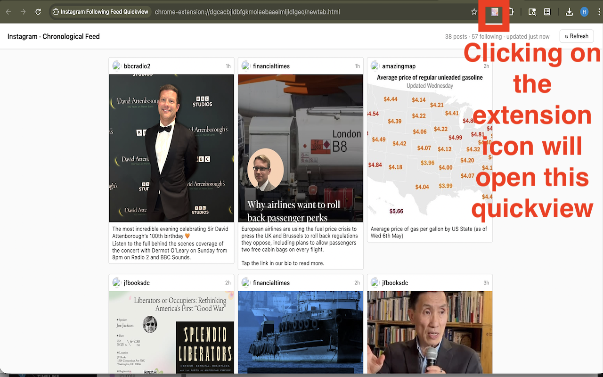
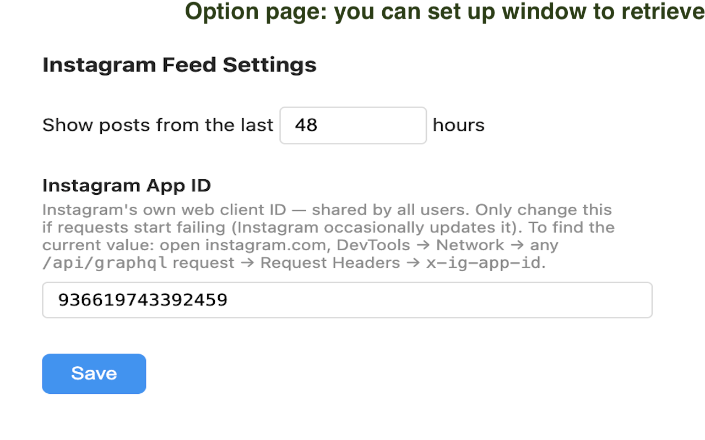

# Instagram Following Feed Quickview

A Chrome extension that shows a fast, chronological grid of posts from the people you follow on Instagram — no algorithm, no suggested posts.

## Features

- **All Following mode** — chronological 5-column grid of recent posts from everyone you follow
- **One User mode** — pick any followed account from a searchable list; see all their posts in a full-width grid where each image gets its own column slot
- Carousel posts show all images inline (no need to open the post)
- Local cache so the feed loads instantly on repeat visits; background refresh keeps it fresh
- Configurable time window (default: last 48 hours)
- Force-refresh button to pull the latest posts immediately

## Installation

This extension is not on the Chrome Web Store. Load it manually:

1. Clone or download this repo
2. Open Chrome and go to `chrome://extensions`
3. Enable **Developer mode** (top-right toggle)
4. Click **Load unpacked** and select the `src/` folder
5. Click the extension icon — a new tab opens with your feed

You must be logged in to Instagram in the same Chrome profile.

## How it works

The background service worker reads your Instagram session cookies (`ds_user_id`, `csrftoken`) and calls Instagram's private mobile API to fetch posts from the accounts you follow. Everything stays local — no data is sent anywhere except back to Instagram's own servers.

See [PRIVACY.md](PRIVACY.md) for the full privacy policy.

## Settings

Click **Options** from the extension's detail page (`chrome://extensions`) to configure:

- **Time window** — how many hours back to show posts (1–168 h)
- **App ID** — Instagram's web client ID, pre-filled with the current value. Only change this if requests start failing; find the current value in DevTools → Network → any `/api/` request → `x-ig-app-id` header

## Caching

| Cache | TTL | Storage |
|---|---|---|
| All-following feed | 5 min (background refresh) | `chrome.storage.local` |
| Single-user feed | 10 min (background refresh) | `chrome.storage.local` |
| Following list | 15 min | `chrome.storage.local` |

All caches are device-local and never transmitted.

## Limitations

- Instagram's private API is undocumented and may change without notice
- Fetching posts for a large following list (500+) can take a few seconds on first load
- Video posts show a thumbnail only
